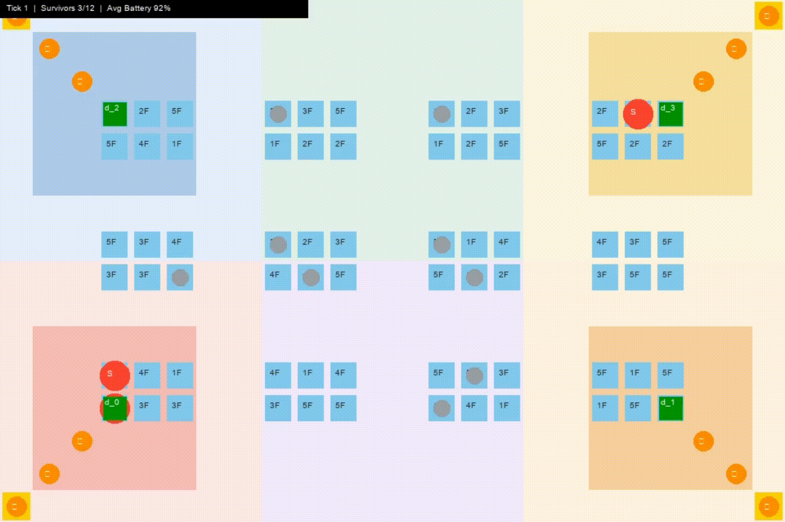
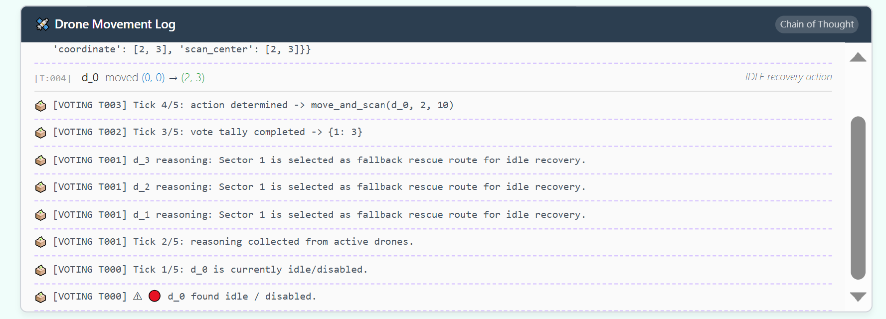
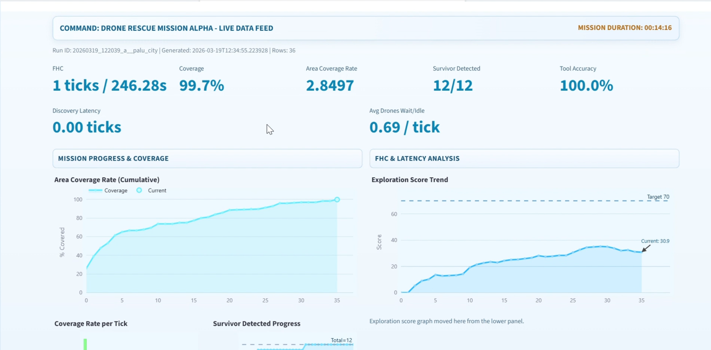
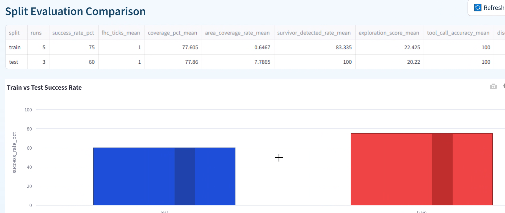

<div align="center">
  <!-- Banner -->
  


  <!-- Logo/Title -->
  

  <h1>MESA-Drone-Swarm-Rescue-Simulation</h1>
  
  <!-- GitHub Stack Tags -->
  <p>
    
    
    
    
    
    
    
  </p>
</div>

# 🚁 **WE DEFINE DRONE SIMULATION**

This project is an advanced **Agent-Based Modeling (ABM)** simulation powered by an entirely autonomous LLM-driven orchestration layer. Set in a post-disaster urban scenario, the system simulates a fleet of search-and-rescue drones tasked with navigating unpredictable environments, bypassing obstacles, managing battery life, and locating survivors. 

Rather than relying on classic hardcoded pathfinding algorithms, our project utilizes **LangChain/LangGraph** and the **Model Context Protocol (MCP)** to give true cognitive reasoning capabilities to the drone swarm. By decoupling the simulation environment (built in **Mesa**) from the decision-making agents, we have created an architecture that doesn't just simulate disaster management—it acts as a highly scalable swarm intelligence layer that is designed to be easily pluggable into real physical drones.

> *"Pioneering the next generation of Search and Rescue: Decentralized AI reasoning via Model Context Protocol, empowering intelligent swarms for the unpredictable realities of disaster management."*

<div align="center">
  
</div>

---

# 🌍 **WE FOCUS REAL WORLD DRONE SIMULATION**

During real-world disaster responses, several key challenges emerge that traditional software or single-agent solutions fail to address. We have tackled these head-on:

> *" 🌟 What makes us stands out? Here are our KEY INNOVATIONS:"*

## 1. **COMMANDER-OPERATOR DUAL CORE ARCHITECTURE** ⚡
   * **Problem:** Single command agents suffer from computing inefficiency and waste tokens when attempting to handle complex, specialized tasks.
   * **Solution:** We use a **Commander + Operator structure**. By adding an Operator agent utilizing **Langchain and LangGraph**, we fully utilize the assigned technology mentioned in the case studies booklet (covering AI implementation, strategy, and configuration). A **Qwen 3-14B** Commander handles high-level strategic reasoning and sectoring, while a lightweight **Qwen 2.5 3B** Operator executes rapid MCP tool calls. Both models are able to run locally via Ollama, ensuring functionality under zero Internet connectivity.

   <div align="center">
  

   </div>

   *(Note: Our architecture fully decouples simulation logic from LLM cognition, utilizing a structured LangGraph-based operator node for reliable agent execution.)*

## 2. **"SWARM VOTING" MECHANISM** 🐝❎
   * **Problem:** Large language models can hallucinate, sometimes missing assigned tasks. When evaluating performance, we found high drone wait counts per tick (idle time) as evidence.
   * **Solution:** An innovative **Swarm Voting Mechanism** (our key innovation) to react and resume the mission if the Commander Agent hallucinate and significantly reduce the impact of hallucinations.

<div align="center">
  
</div>

## 3. **OBSTACLES AVOIDING** 🚧
   * **Problem:** Unforeseen obstacles, such as fallen trees or collapsed buildings, block standard paths.
   * **Solution:** Our drones feature a dynamic rerouting **Bypass Obstacle** mechanism (an additional feature we've integrated directly into the agent behavior), primarily using diagnoal and sidestepping movement.

<div align="center">
  
</div>

## 4. **AUTOMATIC RECALL BASE RECHARGE** 🔋
   * **Problem:** Drones frequently run out of battery midway through crucial tasks.
   * **Solution:** **Automatic recall to base** when battery levels drop to `<= 20%`, ensuring drones can recharge and re-deploy without loss of assets.

<div align="center">
  
</div>

---

# 🛠️ **WE BUILD TECH & DATA**

## 1. Agentic AI mission planning 🧠

- We implement **Commander → Operator** planning with LangGraph in `build_drone_graph()`, where `commander_node()` assigns sectors and `operator_node()` converts each assignment into executable drone actions.
- The mission loop in `Orchestrator.run_mission()` executes these staged decisions step-by-step, while `_do_assign()`, `_do_move()`, and `_do_scan()` close the plan→act→observe cycle.

## 2. MCP Server 💻

- We expose simulation capabilities as MCP tools using `FastMCP` in `mcp_drone_server.py`, including `discover_drones()`, `move_to()`, `thermal_scan()`, and `get_mission_state()`.
- Server-side `MissionStateTracker` centralizes memory with `assign_sectors()` and `to_compressed_dict()`, so agents query state through MCP instead of keeping fragile local memory.

## 3. Strategic Resource Management 📊

- Battery-first safety logic is enforced in `_do_recall()`, `_do_continue_return()`, and `_do_charge()` so low-power drones automatically return and recharge before reassignment.
- Coverage/resource balancing is handled by `_do_assign()` (nearest incomplete sector) plus waypoint queues from `MissionStateTracker.assign_sectors()` to reduce overlap and idle time.

## 4. Handling Real-World Data & Signal Verification 🌐

**Data-Driven Sensor Simulation:**
Our system transforms Palu City's real-world map data through a **Signal Verification pipeline** that strips thermal noise in real-time, simulating authentic sensor bias:

- **Probabilistic Thermal Seeding:** Every drone thermal scan injects probabilistic random seeds (`_thermal_intensity_seed()`) to simulate real-world sensor noise and environmental bias. Raw intensity readings range 0.0–1.0 with calibrated noise bands:
  - **High confidence** (0.85–0.95): survivor present → intensity boosted
  - **Environmental noise** (0.15–0.65): false positives filtered out
  - **Low signal** (0.30–0.38): background clutter

- **Real-Time Verification Filter (`verify_signature()`):** Raw thermal signals are NOT trusted directly. Instead, we:
  1. Extract raw intensity at drone coordinate
  2. Check Moore neighborhood (radius 2) for survivor agents
  3. Apply hard threshold rule: if survivor exists → intensity forced ≥ 0.80
  4. Return **CONFIRMED** (human detected) or **FALSE_POSITIVE** (rejected)
  
  This mimics real SAR equipment that requires multi-source confirmation before declaring a detection.

- **Scenario Variability & Constraint Enforcement:** 
  - Scenario configs (`SCENARIOS`) encode seeded randomization (seeds: 1337, 2026, 7, 42, etc.), ensuring reproducibility while capturing real-world map diversity (Palu City, hotspot clusters, scattered perimeters, building-dense urban).
  - Survivor placement is clamped, de-duplicated, and obstacle-aware to prevent invalid data states.
  - Obstacle routing in `move_to()` enforces real building constraints (high/low height categories) so pathfinding can't hallucinate through walls.


## 5. Real-Time Tool Discovery 🔨

- Real-time capability discovery is done by `Orchestrator.initialize()` via `session.list_tools()`, then fleet discovery with `discover_drones()` (no hardcoded drone IDs).
- In the LangGraph path, `build_mcp_graph_tools()` dynamically loads MCP tools (`load_mcp_tools`) so operator behavior can adapt to currently available server tools.

## 6. Performance Evaluation 💯

**Data & Performance Evaluation Pipeline**
We built a robust pipeline that continuously evaluates the efficacy and intelligence of the swarm during the simulation. 

**Train/Test Split Key Findings (Different Maps):**
- Training success rate reached **75%**.
- Testing success rate reached **60%**.
- Overall map coverage stayed in the **~70%** range.
- Survivor detection remained strong, with testing scenario detection reaching **100%**.

**Benchmark Metrics (Live Data Feed):**
* **A) Mission Efficacy**
  * **First Human Contact (FHC) time:** Measuring speed of initial victim discovery. **(Score: 1 ticks / 246.28s)**
  * **Area Coverage / Rate:** Percentage of the environment successfully mapped. **(Score: 99.7% Total / 2.8497 Rate)**
  * **Survivor Detected Rate:** Proportion of total survivors located by the drone swarm. **(Score: 12/12 or 100%)**

* **B) Swarm Intelligence**
  * **Exploration Score:** A composite metric that rewards high area coverage while penalizing redundancy. **(Current Score: 57.9)**
  * **Avg Drones Wait/Idle:** A penalty for drones crowding together or waiting idly instead of spreading out. **(Score: 0.69 / tick)**
  * **Average Battery:** Ensuring optimal power management across the fleet. **(Score: 73.2%)**

* **C) Agentic & MCP Performance**
  * **Tool Call Accuracy:** The percentage of the Agent's tool calls (e.g., `move_to`, `thermal_scan`) that are syntactically correct and logically sound. **(Score: 100.0%)**
  * **Discovery Latency:** The time it takes for the Agent to identify and task a new drone appearing on the network via MCP discovery. **(Score: 0.00 ticks)**

**Visualizing Our Metrics:**
Here is evidence of our evaluations and wait count visualizations. For any poor metrics identified, our pipeline allows us to propose and test practical future solutions to resolve them.

<div align="center">
  
</div>

<div align="center">
  
</div>

## 7. Tech Stack 👩‍💻

**🧠 Agentic AI & Orchestration**
- 
- 
- 
- 
- 

**🎮 Simulation & Environment**
- 
- 
- 

**🤖 LLM & AI Providers**
- 
- 
- 
- 
- 

**📊 Visualization & Dashboards**
- 
- 
- 
- 
- 

**🔧 Infrastructure & DevOps**
- 
- 
- 
- 
- 

---

# 🤝 **WE DO BUSINESS**

## 1. Market Potential & Demand

Our market potential operates on a powerful dual-flywheel model: **funding life-saving humanitarian missions through highly profitable B2B solutions.**

* 🚨 **Humanitarian & Government Demand:**
  Agencies like **NADMA** urgently require rapid, autonomous deployment solutions to conquer the critical **ASEAN '72-Hour' blackout window** following major disaster events.

* 🏗️ **B2B Infrastructure Licensing:**
  The exact same AI swarm orchestration will be licensed to enterprise giants like **Petronas** and **Edotco** for hazardous infrastructure inspections, remote thermal scanning, and automated maintenance tracking.

**Scalable Business Model:**

1. **Platform as a Service (PaaS):** 
   A subscription model aimed at disaster relief agencies (e.g., FEMA, Red Cross) providing on-demand access to our cloud-based orchestrator and simulated training environments.
2. **Licensing:** 
   Per-drone or per-fleet licensing models for our proprietary Agentic Intelligence Layer (the Commander + Operator architecture), designed for commercial and industrial drone operators.

<div align="center">
  
  
</div>

## 2. Impact & Social Value

This isn't just a tech demo—**it's about saving lives.** Our solution directly addresses critical humanitarian and infrastructure gaps:

**🩺 SDG 3: Good Health and Well-Being**
- **Automating thermal scanning** eliminates human bottlenecks of pilot fatigue and limited visibility.
- **Golden Hour optimization:** By eliminating delays in victim identification, we drastically reduce mortality in the critical 72-hour window post-disaster.
- Autonomous surveillance reduces dependency on exhausted responders and expensive aerial support, bringing detection speed to seconds.

**⚙️ SDG 9: Industry, Innovation & Infrastructure**
- **Software as Infrastructure:** We prove that AI swarm orchestration is critical infrastructure, not luxury.
- **Sovereign AI resilience:** Our architecture doesn't rely on foreign cloud services during blackouts. Drones operate on local MCP protocol with zero external dependencies—critical when the internet goes down.
- Designed for deployment in ASEAN and other regions where infrastructure bottlenecks are severe.

**🌍 Geographic Equity & Accessibility**
- **The Great Divider Gap:** High-tech rapid response has historically been confined to wealthy nations and urban centers.
- Our swarm acts as a **geographic equalizer**, bringing military-grade autonomous coordination to remote and marginalized communities that lack resources for pilot-dependent systems.
- Sovereignty + affordability = disaster response that serves those who need it most, not just the highest bidders.

## 3. Sustainability

**Operational Sustainability: Carbon-Efficient Response**
- **95% carbon reduction vs. helicopters:** Our AI-optimized pathing maximizes battery life and minimizes energy waste, making drone swarms drastically more sustainable than traditional aerial rescue.
- **Smart energy allocation:** The Commander→Operator architecture ensures every tool call (move, scan, charge) is strategically planned, eliminating wasteful redundancy and frivolous movements.
- **Renewable-ready:** Designed to integrate with solar-charged dock stations, enabling indefinite autonomous operations in remote areas without infrastructure.

**Financial Sustainability: Commercial-to-Humanitarian Subsidization (C2H)**
- **Cross-subsidy model:** B2B commercial revenue from industrial inspections (Petronas, Edotco, energy sector) **fully funds** our R&D and core platform development.
- **Zero-cost government licensing:** Government disaster relief agencies (NADMA, FEMA, Red Cross) receive our full enterprise software suite at **zero licensing cost**—because profit comes from commercial clients, not from saving lives.
- **Self-sustaining ecosystem:** This inverts the typical CapEx bottleneck: profit drives innovation, while humanitarian missions remain permanently affordable and scalable.
- **Long-term viability:** Unlike donor-dependent NGOs, our model ensures the software survives indefinitely, scales globally, and stays free when lives are at stake.

<div align="center">
  

</div>

---

# 🏃‍♀️ **How to Run**

1. **Install dependencies:**
   ```bash
   pip install -r requirements.txt
   ```

2. **Insert OpenRouter API Key in .env file**
   ```
   OPENROUTER_API_KEY=YOUR_API_KEY
   ```
   
3. **Run the simulation:**
   ```bash
   cd controllers
   python mesa_drone_rescue_langgraph_trace.py
   ```

4. **Run the Dashboard (Separate Terminal):**
   ```bash
   cd evaluation
   streamlit run streamlit_metrics_dashboard.py
   ```

